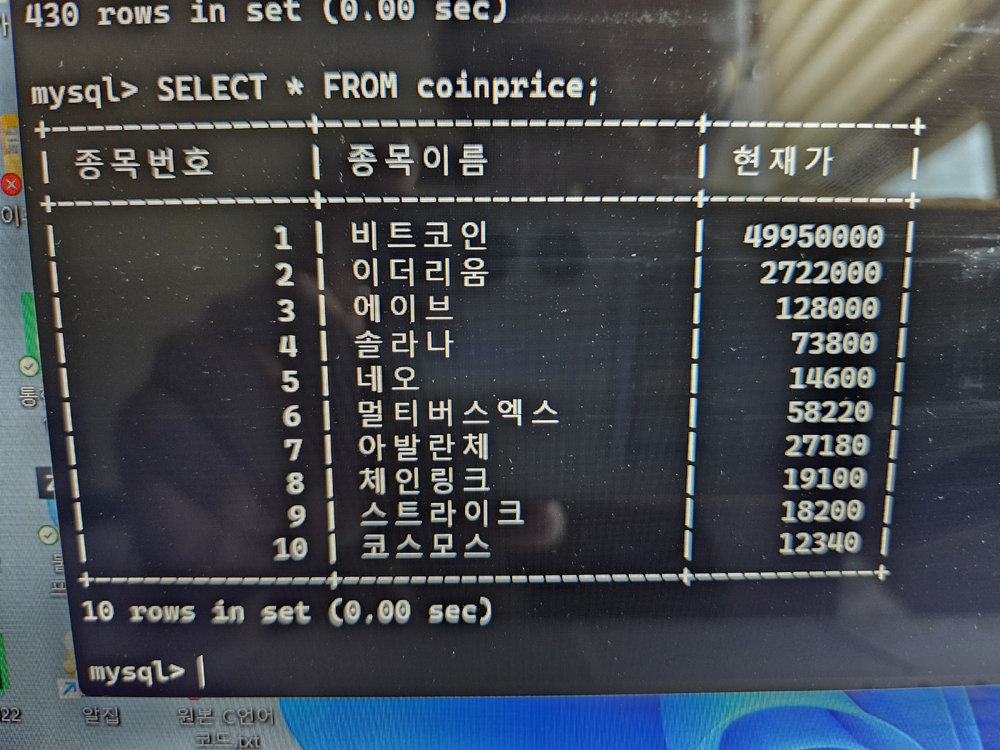

# 💰 코인 투자 체험 서버 프로젝트

---

## 📌 프로젝트 개요
- **목적**: 사용자가 코인 투자를 체험하며 투자 지식을 습득하도록 돕는 서버 구축  
- **필요성**:  
  - 실시간 코인 가격 정보를 제공하는 DB 필요  
  - DB 업데이트를 위한 24시간 동작 서버 필요  
  - 사용자가 체험을 통해 실제 투자와 같은 경험을 느낄 수 있도록 구현  

---

## 📝 요구사항 분석
- 실제 코인 데이터를 서버에 저장할 수 있어야 함  
- 특정 코인의 종목명, 현재가, 당일 최고가/최저가 등 확인 가능해야 함  
- 코인 데이터는 실시간으로 1분마다 갱신되어야 함  
- 사용자는 서버에서 제공하는 가격 변동을 확인 가능해야 함  
- 자체 제작 코인도 DB에 추가 가능해야 함  

---

## 🛠 사용 기술
- **Python**  
  - `pymysql` 라이브러리: MySQL DB 연동 및 데이터 저장/갱신  
  - `requests` / `pyupbit`: 업비트(https://www.upbit.com) API 활용, 시세 데이터 수집  
- **AWS**  
  - EC2: 서버 환경 구축 및 실행  
  - RDS (MySQL): 코인 DB 관리  
- **개발 환경**: Visual Studio Code  

---

## 🗄 데이터베이스 설계
### 테이블: `coinTable`
- **컬럼**  
  - `item_number`: 종목번호 (PK)  
  - `item_name`: 종목명  
  - `price`: 현재가  
  - `daily_maxprice`: 당일 최고가  
  - `daily_minprice`: 당일 최저가  

---

## 📅 프로젝트 일정

1. **서버 계획서 작성** (~10/30)  
2. **코인 시세 서버 구축** (~11/13)  
   - 코인 5개 종목 선택  
   - 업비트 API를 활용한 실시간 시세 데이터 수집  
   - AWS RDS에 DB 생성 (`coinDB`, 테이블: `coinTable`)  
   - 초기 데이터 입력 및 실시간 데이터 저장 기능 구현  
3. **자체 코인 제작 및 서버 적용** (~11/27)  
   - 자체 코인 이름 설정 및 초기 데이터 생성  
   - 가격 변동 범위 정의 (예: 500만원 ± 50만원)  
   - 24시간 랜덤 가격 변동 로직 제작 및 DB 삽입  

---

## 📊 프로젝트 결과
- 업비트 API를 통해 실시간 코인 데이터 수집 및 DB 저장 성공  
- AWS EC2 + RDS 환경에서 안정적으로 서버 운영  
- 자체 코인 제작 및 시뮬레이션 데이터 삽입까지 완료  

---

## 📸 시연 결과

### ✅ 실시간 코인 시세 조회 (DB SELECT 결과)

## 🤔 느낀점
- 실시간 데이터 처리와 DB 연동을 직접 경험하며 서버/DB 운영 역량 강화  
- 코인 데이터를 다루는 과정에서 데이터 무결성과 주기적 업데이트의 중요성을 체감  
- 향후 더 다양한 API와 웹 서비스를 연계해 확장할 수 있다는 자신감을 얻음  

---

## 🙋 팀원
- 이채희  

---

## 📝 한줄 요약
> 코인 시세 API와 자체 제작 코인을 활용해  
> **실시간 데이터 수집 → DB 저장 → 서버 운영**까지 구현한 체험형 프로젝트
